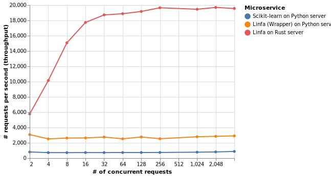
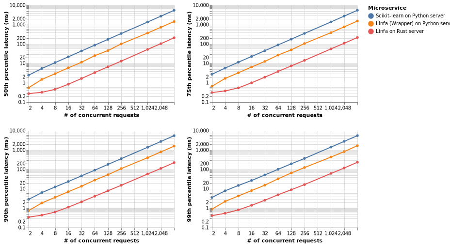
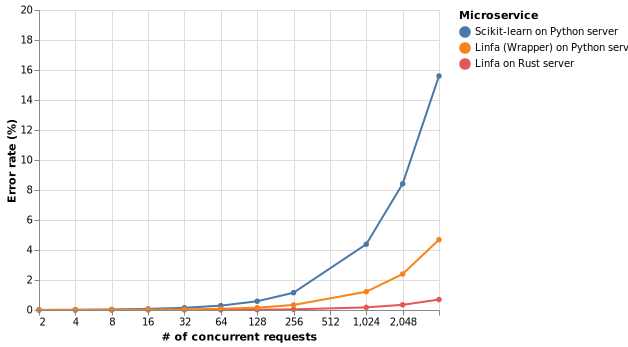

# Clustering benchmarks

K-means is a clustering algorithm - we compare the reference implementation provided by 
`scikit-learn` with the Rust implementation provided by `linfa`.

In order to perform a fair comparison, we also include performance
measured calling `linfa` from Python, using its same name Python wrapper 
[`linfa`, available on PyPi](https://pypi.org/project/linfa/). 
We'll refer to it as `linfa (Python wrapper)` for clarity.

In particular, we compare:
- training times;
- inference time, as measured when the model is exposed as a gRPC microservice.

This repository contains all the source code required to reproduce the benchmarks as well as
instructions to do so.

## Results

### Training

`linfa (Python wrapper)` is ~11x faster than `scikit-learn` in training a `K-Means` model
on a dataset of 1 million points:

| Library | Mean training time (ms) |
|---------|--------------------|
| Linfa (Python wrapper on Rust) | 395.26 |
| Scikit-learn | 4,338.4951 **(10.98x slower)** |

### Inference

> _`linfa` on a Rust web server provides **~25x** better performance (requests per second, latency) compared
to `scikit-learn` and **~7x** compared to `linfa (Python wrapper)` on a Python web server. 
It also provides the lowest error rate under heavy load._

For inference, `linfa (Python wrapper)` provides a 3.5x increase in throughput (number of requests per second)
compared to `scikit-learn` using the same underlying web server (Python's `grpcio`).

`linfa` on a Rust web server ([`tonic`](https://github.com/hyperium/tonic)) handles **25x** more requests
per second than `scikit-learn` and **7x** more than `linfa (Python wrapper)` on a Python web server.


The same holds for latency (how long it takes to provide a response), where `linfa (Python wrapper)` 
is consistently ~3.5x faster than `scikit-learn` across all percentiles.

`linfa` on a Rust web server is consistently **26x** faster than `scikit-learn` and **7x** faster than
than `linfa (Python wrapper)` on a Python web server.


The Python web-server remains more stable under heavy load when serving `linfa (Python wrapper)` 
compared to `scikit-learn` in terms of error rate (% of failed requests over total).

`linfa` on a Rust web server has the lowest error rate under heavy load.



## Training benchmark

We compare how long it takes to train a K-means model for:
- `scikit-learn`, with `init="random"`, `algorithm="full"` (Lloyds' algorithm);
- `linfa-k-means` (Lloyds' algorithm, Python wrapper around the `linfa-clustering` Rust implementation).
  
We use the same hyperparameters for all models:
- maximum number of iterations, `100`;
- tolerance, `1e-4`;
- number of clusters, `3`.

The comparison is run from Python using `pytest`'s benchmarking functionality on a synthetic dataset
of 1 million points.

### Running the benchmark

```bash
cd python-grpc
# Install the required packages in a virtual environment
poetry install
poetry run pytest 
```

## Inference benchmark 

We compare the inference performance of the K-Means model exposed as a gRPC microservice.
The following setups are compared:
- `scikit-learn` exposed with Python's [`grpcio`](https://grpc.io/docs/quickstart/python/);
- `linfa-k-means` exposed with Python's [`grpcio`](https://grpc.io/docs/quickstart/python/);
- `linfa-clustering` exposed with Rust's [`tonic`](https://github.com/hyperium/tonic).

The comparison is run using [`ghz`](https://ghz.sh/).

### Test data

The data used for the inference benchmark can be found in the `data` folder.

The utils under `rust-grpc/src/bin` can be used to generate additional/different test data. Check 
`rust-grpc/README.md` for more details.

### Launching the gRPC microservices

Launch Python's microservice on port `5001`, serving `scikit-learn`'s model:
```bash
cd python-grpc
# Install the required packages in a virtual environment
poetry install
poetry run python src/main.py
```

Launch Python's microservice on port `5001`, serving `linfa`'s model (Python wrapper over Rust):
```bash
cd python-grpc
# Install the required packages in a virtual environment
poetry install
RUST=true poetry run python src/main.py
```

Launch Rust's microservice on port `5001`, serving `linfa`'s model (Rust):
```bash
cd rust-grpc 
cargo run --release -- --port 5001 --model=../data/rust_k_means_model.json
```

### Running the benchmark

After you have launched the microservice you want to benchmark, you can measure its performance with:
```bash
ghz \
    --proto=protos/centroids.proto \
    --call=ml.ClusteringService.Predict \
    --insecure \
    --data-file=data/observations.json \
    --duration 30s \
    --concurrency $concurrency \
    --format json \
    localhost:5001 \
```

All benchmarks run for 30s, testing different levels of client-side concurrency (64, 128, 256, 512, 1024 concurrent requests) 
for each server.

If you want to skip a lot of manual error-prone command typing, you can use the `run_benchmark.sh` bash script.
Result summaries can be found under `grpc-benchmark-outputs`.

## Machine specs

All the benchmarks have been run on the same machine, with following specifics:
- CPU: _AMD Ryzen 7 1700 Eight-Core Processor_
- RAM: _4x8GB DDR4_

